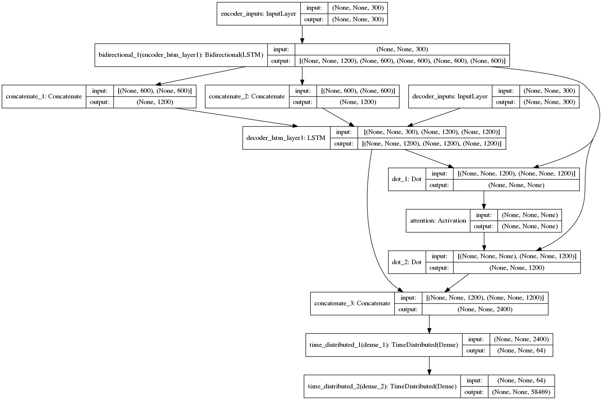

# Text-Summarization Using Deep Learning
Jupyter notebooks for text summarization using Deep Learning techniques

#### -- Project Status: Active

## Introduction
The purpose of this project is to produce a model for Abstractive Text Summarization, starting with the RNN encoder-decoder as the baseline model. From there, we come across the effectiveness of different methods for attention in abstractive summarization. These methods try to first understand the text and then rephrase it in a shorter manner, using possibly different words. For perfect abstractive summary, the model has to first truly understand the document and then try to express that understanding in short possibly using new words and phrases. We have used the concept of an encoder-decoder recurrent neural network with LSTM units and attention to generate summary from a given text.

### Methods Used
* Word Embeddings using GloVe (Global Vectors)
* Encoder-decoder using RNN(Recurrent Neural Network)

### Technologies
* Python
* Keras Library
* TensorFlow
* Jupyter
* etc.

## Description
In this project we have used a [sample dataset of news articles (CNN , Daily Mail)](https://github.com/JafferWilson/Process-Data-of-CNN-DailyMail). Currently we are facing a problem in implementing the pointer-generator network.

## Architecture


## Learning Rate Configuration


`CyclicLR(mode='triangular2', base_lr= 0.2, max_lr= 0.001,
                          step_size= (len(padded_sorted_texts)*0.9/BATCH_SIZE) * 2)`

## Word Embeddings


* ConceptNet Numbernatch word embeddings were used to encode the word meanings

## Getting Started

1. Clone this repo (for help see this [tutorial](https://help.github.com/articles/cloning-a-repository/)).
2. Raw Data is being kept on the local storage at the location ~/Text-Summarization/Original_data/cnn/stories

3. Data processing/transformation scripts are being kept [here](Repo folder containing data processing scripts/notebooks)
4. Installation steps:
  Use `single backticks` to call out code or a command within a sentence.
  ```
  To format code or text into its own distinct block, use triple backticks
  example:
    git status
    git commit -m
  ```

## Featured Notebooks/Analysis/Deliverables
* [Notebook/Markdown/Slide Deck Title](link)
* [Notebook/Markdown/Slide DeckTitle](link)
* [Blog Post](link)
* [Blog Post](link)


## Contributing Team Members

**Team Lead (Contacts) : [Nikhil Gupta](https://github.com/nikhilcss97)**

#### Other Members:

[Blair Fernandes](https://github.com/blair49), [Asjad Baig]

## Contact
* Feel free to contact me on nikhil.css97@gmail.com with any questions or if you are interested in contributing!
